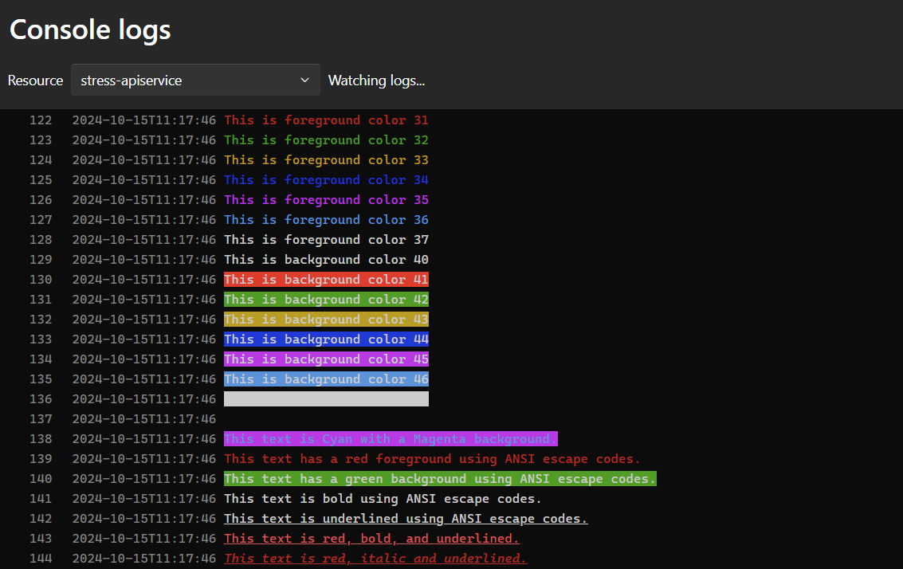
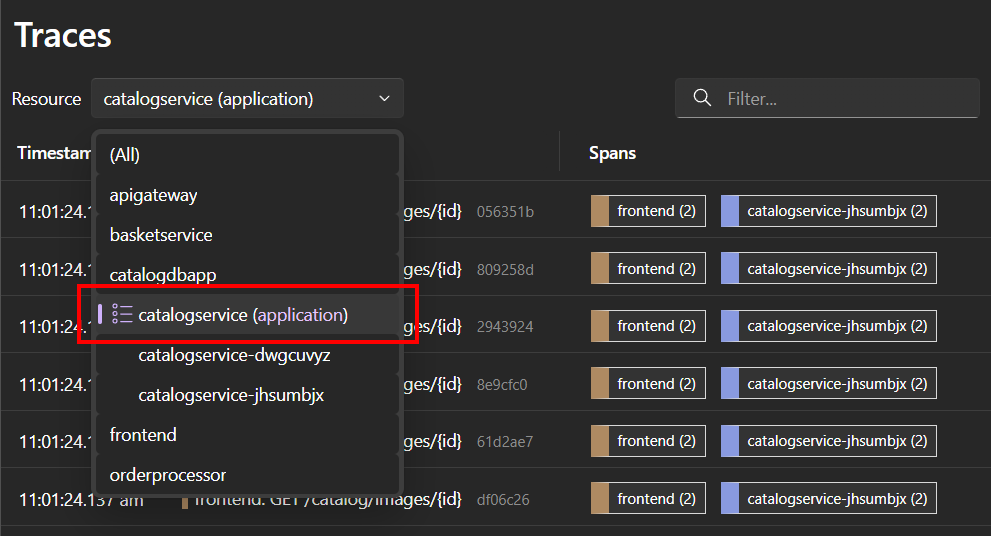
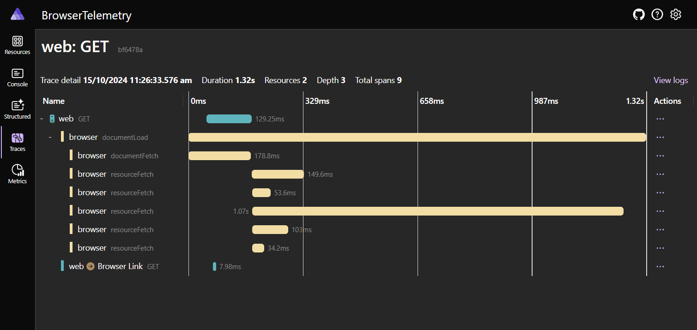
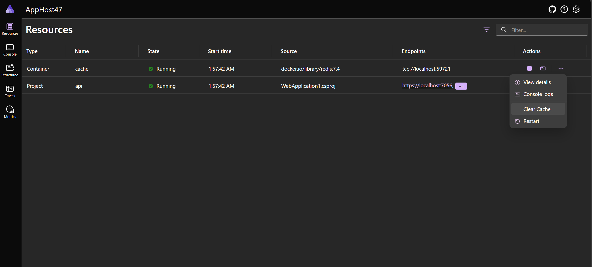
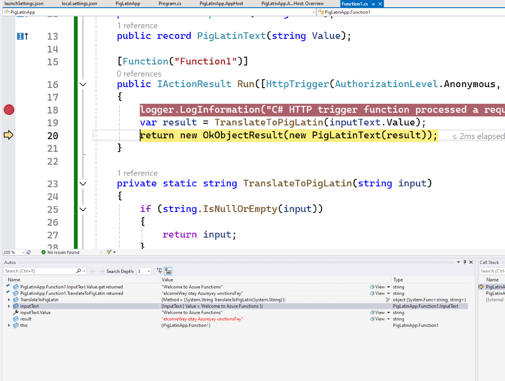

# .NET Aspire 9.0 (Release Candidate 1)

.NET Aspire 9.0 is the next major release of .NET Aspire; it will support BOTH .NET 8 (LTS) and .NET 9. .NET Aspire 9.0 addresses some of the most highly requested features and pain points from the community. 

## Upgrade to .NET Aspire 9.0

Instructions on how to upgrade here

- Visual Studio
- Visual Studio Code
- Command Line
- Upgrade assistant ???

### Acquisition

.NET Aspire 9.0 simplifies acquisition by providing a .NET Aspire SDK available as the [📦 `Aspire.AppHost.Sdk`](https://nuget.org/packages/Aspire.AppHost.Sdk) NuGet package. This will no longer require an extra step to acquire the tooling required to build .NET Aspire projects. In other words, starting with .NET Aspire 9—you don't need to install a .NET workload.

```xml
<Project Sdk="Microsoft.NET.Sdk">

  <Sdk Name="Aspire.AppHost.Sdk" Version="9.0.0-rc.1.24511.1" />

  <PropertyGroup>
    <OutputType>Exe</OutputType>
    <TargetFramework>net8.0</TargetFramework>
    <ImplicitUsings>enable</ImplicitUsings>
    <Nullable>enable</Nullable>
    <IsAspireHost>true</IsAspireHost>
    <UserSecretsId>0afc20a6-cd99-4bf7-aae1-1359b0d45189</UserSecretsId>
  </PropertyGroup>

  <ItemGroup>
    <PackageReference Include="Aspire.Hosting.AppHost" Version="9.0.0-rc.1.24511.1" />
  </ItemGroup>

</Project>
```

For more information, see [.NET Aspire app host project](../fundamentals/app-host-overview.md#app-host-project).

### Templates

.NET Aspire 9 introduces a new project template for creating .NET Aspire projects. This template is available from the [`dotnet new` command](/dotnet/core/tools/dotnet-new). These can be installed by running the following command:

```dotnetcli
dotnet new install Aspire.ProjectTemplates::9.0.0-rc.1.24511.1
```

TODO: Paste command output here in a triple-back-tick `dotnetcli` code block.

## Dashboard

### Manage resource lifecycle

The most requested feature for the dashboard is to manage the lifecycles of your orchestrated named resources. Specifically, the ability to stop, start, and restart resources. This feature is now available in .NET Aspire 9.

<!-- markdownlint-disable MD033 -->
<video controls src="videos/start-stop-restart.mp4" title="Title"></video>
<!-- markdownlint-enable MD033 -->

This feature works for projects, containers and executables. It enables restarting indidivual resources without having to restart the entire app host. For projects, if the debugger is attached, on restart, the debugger will be re-attached.

- Responsive design
- Mobile friendly

### Sensitive properties, volumes and health checks in resource details

Resource details has seen a lot of improvements:

- Properties can be marked as sensitive, automatically masking them in the dashboard UI. This is a security feature to avoid accidently disclosing keys or passwords when screen sharing the dashboard with other people. For example, container arguments could pass sensitive information and so are masked by default.

- Configured container volumes are listed in resource details.

- Detailed information about resource health checks, a new feature in Aspire 9, are listed in resource details. This information is useful to understand why a resource might be marked as unhealthy. Find out more about health checks [here](#resource-health-checks).

### Coloreful console log

[ANSI escape codes](https://wikipedia.org/wiki/ANSI_escape_code) are used to add text formatting to text. For example, foreground and background colors, bold, underline, italics, etc. The dashboard console logs page previously supported rendering one ANSI escape code at a time and failed when they were combined together. The console logs page could show red text, but it couldn't show text that is red and bold at the same time.

A community contribution from [@mangeg](https://github.com/mangeg) improved support for ANSI escape codes and removed this limitation. Behold:



Another improvement to console logs is hiding unsupported escape codes. Codes that aren't related to displaying text, such as positioning the cursor or communicating with the operating system don't make sense in this UI, and are hidden.

## Telemetry

### Improve telemetry filtering

Traces can now be filtered with attribute values. For example, if you only want to view traces for one endpoint in your app, the `http.route` attribute on HTTP requests can be filtered to a specified value.

Telemetry filtering also supports auto-complete of existing values. The **Add filter** dialog provides a combo box for selecting from values that dashboard has received. This feature makes it much easier to filter to real data and helps avoid typos by entered a value yourself.

<video controls src="videos/trace-filter.mp4" title="Video of filtering traces"></video>

### Combine telemetry from multiple resources

It's now possible to filter telmetry in the dashboard to all instances of a resource. This is useful if you have multiple replicas for an app and want to view their telemetry together.

To view telemetry for all instances of a resource, select the top-level option in the resource selector that's marked with `(application)`:



### Browser telemetry support

The dashboard now supports OTLP HTTP and CORS. These features unlock the ability to send OpenTelemetry from browser apps to the dashbaord.

For example, an app built with React can configure the [JavaScript OTEL SDK](https://opentelemetry.io/docs/languages/js/getting-started/browser/) to send structured logs, traces and metrics created in the browser to the dashboard. Browser telemetry is displayed alongside server telemetry.



For more information on configuring browser telemetry, see [Enable browser telemetry](https://learn.microsoft.com/dotnet/aspire/fundamentals/dashboard/enable-browser-telemetry) documentation.

## App Host (Orchestration)

### Waiting for dependencies

The app host now supports waiting for dependencies to be ready before starting another resource. This is useful when a resource is taking a long time to start up. The app host will wait for the resource to be ready before starting any dependent resources.

```C#
var builder = DistributedApplication.CreateBuilder(args);

var queue = builder.AddRabbitMQ("rabbit");

builder.AddProject<Projects.WebApplication1>("api")
    .WithReference(queue).WaitFor(queue);

builder.Build().Run();
```

When the app host starts, it will wait for the `rabbit` resource to be ready before starting the `api` resource:

<!-- markdownlint-disable MD033 -->
<video controls src="media/waitfor.mp4" title="Title"></video>
<!-- markdownlint-enable MD033 -->

There are two methods exposed to wait for a resource:

1. `WaitFor`: Wait for a resource to be ready before starting another resource.
1. `WaitForCompletion`: Wait for a resource to complete before starting another resource.

#### Resource health checks

`WaitFor` uses health checks to determine if a resource is ready. If a resource does not have any health checks, the app host will wait for the resource to be in the "Running" state before starting the dependent resource.

For resources that expose HTTP endpoints we have added a streamlined way to define a health check which polls a specific path for a HTTP 200 response.

```C#
var builder = DistributedApplication.CreateBuilder(args);

var catalogApi = builder.AddContainer("catalog-api", "catalog-api")
                 .WithHttpEndpoint(targetPort: 8080)
                 .WithHttpHealthCheck("/healthz");

builder.AddProject<Projects.WebApplication1>("store")
    .WithReference(catalogApi.GetEndpoint("http"))
    .WaitFor(catalogApi);

builder.Build().Run();
```

The above example adds a health check to the `catalog-api` resource. The app host will wait for the health check to return a healthy status before starting the `store` resource. It'll determine that the resource is ready when the the /healthz endpoint returns a 200 status code.

The health checks mechanism in the app host builds upon the `IHealthChecksBuilder` implementation from the `Microsoft.Extensions.Diagnostics.HealthChecks` namespace. Creating a custom health check is simple, first define a custom
health check, and then associate the health check name with the resource.

```C#
var builder = DistributedApplication.CreateBuilder(args);

var healthyAfter = DateTime.Now.AddSeconds(20);
builder.Services.AddHealthChecks().AddCheck(
    "delay20secs",
    () => DateTime.Now > healthyAfter ? HealthCheckResult.Healthy() : HealthCheckResult.Unhealthy()
    );

var cache = builder.AddRedis("cache")
                   .WithHealthCheck("delay20secs");

builder.AddProject<Projects.MyApp>("myapp")
       .WithReference(cache).WaitFor(cache);
```

The above example shows using a custom health check to blow the start up of the dependent project resource until 20 seconds
after the apphost starts running. The `WithHealthCheck(...)` mechanism provides a simple mechanism to assocate a resource
with health checks that are already registered in the health checks system by name (`delay20secs`).

### Persistent containers

The app host now supports persistent containers. This is useful when you want to keep the container running even after the app host has stopped. These containers will not be stopped unless they are stopped manually using the container runtime.

To do this, call the `WithLifetime` method and pass in `ContainerLifetime.Persistent`:

```C#
var builder = DistributedApplication.CreateBuilder(args);

var queue = builder.AddRabbitMQ("rabbit")
                   .WithLifetime(ContainerLifetime.Persistent);

builder.AddProject<Projects.WebApplication1>("api")
    .WithReference(queue).WaitFor(queue);

builder.Build().Run();
```

The dashboard will show persistent containers with a pin icon:


After the app host has stopped, the container will continue to run:


The container persistence mechanism attempts to identify when you may wish to recreate the container. For example if the environment
for the container changes then the container will be restarted so that you don't need to manually stop the container if you have changed
the input configuration for the resource.

### Resource commands

The app host supports adding custom commands to resources. This is useful when you want to run custom commands on a resource. This can be done by calling the `WithCommand` method and passing in the command to run:

```C#
var builder = DistributedApplication.CreateBuilder(args);

var cache = builder.AddRedis("cache")
                   .WithClearCommand();

builder.AddProject<Projects.WebApplication1>("api")
    .WithReference(cache)
    .WaitFor(cache);

builder.Build().Run();
```

The command implementation:

```C#
using Microsoft.Extensions.Diagnostics.HealthChecks;
using StackExchange.Redis;

public static class RedisCommandExtensions
{
    public static IResourceBuilder<RedisResource> WithClearCommand(this IResourceBuilder<RedisResource> builder)
    {
        builder.WithCommand("clear-cache", "Clear Cache",
            async context =>
            {
                var redisConnectionString = await builder.Resource.GetConnectionStringAsync() 
                    ?? throw new InvalidOperationException("Unable to get the Redis connection string.");
                
                using var connection = ConnectionMultiplexer.Connect(redisConnectionString);

                await connection.GetDatabase().ExecuteAsync("FLUSHALL");

                return CommandResults.Success();
            },
            context =>
            {
                if (context.ResourceSnapshot.HealthStatus == HealthStatus.Healthy)
                {
                    return ResourceCommandState.Enabled;
                }
                return ResourceCommandState.Disabled;
            });
        return builder;
    }
}
```

These commands can be run from the dashboard:



<!-- markdownlint-disable MD033 -->
<video controls src="videos/custom-command.mp4" title="Title"></video>
<!-- markdownlint-enable MD033 -->

### Container networking

The app host now adds all containers to a common network (`default-aspire-network`). This is useful when you want to communicate between containers without going through the host network.

This also makes it easier to migrate from docker compose to the app host, as containers can communicate with each other using the container name.

### Eventing model

The eventing model allows developers to hook into the lifecycle of the application and resources. This is useful for running custom code at specific points in the application lifecycle. There are various ways to subscribe to events, including global events and per-resource events.

**Subscribe to a global event**

```C#
var builder = DistributedApplication.CreateBuilder(args);

// Subscribe to a global event
builder.Eventing.Subscribe<BeforeStartEvent>((evt, token) =>
{
    Console.WriteLine("Before the application starts!");

    return Task.CompletedTask;
});

builder.Build().Run();
```

**Subscribe to a per-resource event for a specific resource**

```C#
var builder = DistributedApplication.CreateBuilder(args);

var cache = builder.AddContainer("cache", "redis")
                   .WithEndpoint(targetPort: 6379);

cache.Subscribe<ResourceReadyEvent>(cache.Resource, (evt, token) =>
{
    Console.WriteLine($"Resource {evt.Resource.Name} is ready!");

    return Task.CompletedTask;
});
```

**Subscribe to a per-resource event for *all* resources**

```C#
var builder = DistributedApplication.CreateBuilder(args);

var cache = builder.AddContainer("cache", "redis")
                   .WithEndpoint(targetPort: 6379);

// Subscribe to a per-resource event for *all* resources
builder.Eventing.Subscribe<BeforeResourceStartedEvent>((evt, token) =>
{
    Console.WriteLine($"Before {evt.Resource.Name}");

    return Task.CompletedTask;
});

builder.Build().Run();
```

**Global events**

- **BeforeStartEvent** - An event that is triggered before the application starts. This is the last place that changes to the app model will be observed. This runs in both Run and Publish modes. This is a blocking event, meaning that the application will not start until all handlers have completed.

- **AfterResourcesCreatedEvent** - An event that is triggered after the resources have been created. This runs in Run mode only.

- **AfterEndpointsAllocatedEvent** - An event that is triggered after the endpoints have been allocated for all resources. This runs in Run mode only.

**Per-resource events**

- **BeforeResourceStartedEvent** - An event that is triggered before a single resource starts. This runs in Run mode only. This is a blocking event, meaning that the resource will not start until all handlers have completed.

- **ConnectionStringAvailableEvent** - An event that is triggered when a connection string is available for a resource. This runs in Run mode only.

- **ResourceReadyEvent** - An event that is triggered when a resource is ready to be used. This runs in Run mode only.

The example below demonstrates how to run custom code before a resource starts and when a resource is ready.

```C#
var builder = DistributedApplication.CreateBuilder(args);

var queue = builder.AddRabbitMQ("rabbit");

// Subscribe to a per-resource event for *all* resources
builder.Eventing.Subscribe<BeforeResourceStartedEvent>(queue.Resource, (evt, token) =>
{
    Console.WriteLine($"Before {evt.Resource.Name}");

    return Task.CompletedTask;
});

builder.Eventing.Subscribe<ResourceReadyEvent>(queue.Resource, (evt, token) =>
{
    Console.WriteLine($"Resource {evt.Resource.Name} is ready");
    return Task.CompletedTask;
});

builder.Build().Run();
```

## Integrations

### Redis Insight

A new extension method has been added to support starting up Redis Insight on a Redis resource:

```C#
var builder = DistributedApplication.CreateBuilder(args);
builder.AddRedis("redis")
       .WithRedisInsight(); // Starts a Redis Insight container image
                            // that is preconfigured to work with the
                            // Redis instance.
```

The `WithRedisInsight(...)` extension method can be applied to multiple
Redis resources and they will each be visible on the Redis Insight dashboard.


### Open AI

### Mongo 

Password enabled

### Azure

- AzurePostgres
- AzureRedis
- AzureSql

### Azure Functions Support (Preview)

Support for Azure Functions is one of the most widely requested features on the Aspire issue tracker and we're excited to introduce preview support for it in this release. To demonstrate this support, let's use Aspire to create and deploy Functions application for a popular scenario: a webhook.

To get started, create a new Azure Functions project using the Visual Studio New Project dialogue. When prompted, select the "Enlist in Aspire orchestration" checkbox when creating the project.


In the AppHost project, observe that there is a `PackageReference` to the new `Aspire.Hosting.Azure.Functions` package:

```xml
<ItemGroup>
    <PackageReference Include="Aspire.Hosting.AppHost" Version="9.0.0-rc.1.24511.1" />
    <PackageReference Include="Aspire.Hosting.Azure.Functions" Version="9.0.0-preview.5.24513.1" />
</ItemGroup>
```

This package provides an `AddAzureFunctionsProject` API that can be invoked in the AppHost to configure Azure Functions projects within an Aspire host:

```csharp
var builder = DistributedApplication.CreateBuilder(args);

builder.AddAzureFunctionsProject<Projects.PigLatinApp>("piglatinapp");

builder.Build().Run();
```

Our webhook will be responsible for translating an input string into Pig Latin. Let's update the contents of our trigger with the following code:

```csharp
using Microsoft.AspNetCore.Http;
using Microsoft.AspNetCore.Mvc;
using Microsoft.Azure.Functions.Worker;
using Microsoft.Extensions.Logging;
using System.Text;
using FromBodyAttribute = Microsoft.Azure.Functions.Worker.Http.FromBodyAttribute;

namespace PigLatinApp;

public class Function1(ILogger<Function1> logger)
{
    public record InputText(string Value);
    public record PigLatinText(string Value);

    [Function("Function1")]
    public IActionResult Run([HttpTrigger(AuthorizationLevel.Anonymous, "post")] HttpRequest req, [FromBody] InputText inputText)
    {
        logger.LogInformation("C# HTTP trigger function processed a request.");
        var result = TranslateToPigLatin(inputText.Value);
        return new OkObjectResult(new PigLatinText(result));
    }

    private static string TranslateToPigLatin(string input)
    {
        if (string.IsNullOrEmpty(input))
        {
            return input;
        }

        var words = input.Split(' ');
        StringBuilder pigLatin = new();

        foreach (string word in words)
        {
            if (IsVowel(word[0]))
            {
                pigLatin.Append(word + "yay ");
            }
            else
            {
                int vowelIndex = FindFirstVowelIndex(word);
                if (vowelIndex == -1)
                {
                    pigLatin.Append(word + "ay ");
                }
                else
                {
                    pigLatin.Append(word.Substring(vowelIndex) + word.Substring(0, vowelIndex) + "ay ");
                }
            }
        }

        return pigLatin.ToString().Trim();
    }

    private static int FindFirstVowelIndex(string word)
    {
        for (var i = 0; i < word.Length; i++)
        {
            if (IsVowel(word[i]))
            {
                return i;
            }
        }
        return -1;
    }

    private static bool IsVowel(char c) => char.ToLower(c) is 'a' or 'e' or 'i' or 'o' or 'u';
}
```

Set a breakpoint in the first line of the `Run` method and press <kbd>F5</kbd> to start the Functions host. Once the Aspire dashboard launches, you'll observe the following:


Aspire has:

- Configured an emulated Azure Storage resource to be used for bookkeeping by the host
- Launched the Functions host locally with the target as the Functions project registered
- Wired the port defined in `launchSettings.json` of the functions project for listening

Use your favorite HTTP client of choice to send a request to the trigger and observe the inputs bound from the request body in the debugger.

```
$ curl --request POST \
  --url http://localhost:7282/api/Function1 \
  --header 'Content-Type: application/json' \
  --data '{
  "value": "Welcome to Azure Functions"
}'
```



Now we're ready to deploy our application to ACA. Deployment currently depends on preview builds of Azure Functions Worker and Worker SDK packages. If necessary, upgrade the versions referenced in the Functions project:

```xml
<ItemGroup>
    <PackageReference Include="Microsoft.Azure.Functions.Worker" Version="2.0.0-preview1" />
    <PackageReference Include="Microsoft.Azure.Functions.Worker.Sdk" Version="2.0.0-preview2" />
</ItemGroup>
```

We'll also need to expose a public endpoint for our Azure Functions project so that requests can be sent to our HTTP trigger:

```csharp
builder.AddAzureFunctionsProject<Projects.PigLatinApp>("piglatinapp")
    .WithExternalHttpEndpoints();
```

To deploy the application via the `azd` CLI, navigate to the folder containing the AppHost project and run `azd init`:

```
$ azd init

Initializing an app to run on Azure (azd init)

? How do you want to initialize your app? Use code in the current directory

  (✓) Done: Scanning app code in current directory

Detected services:

  .NET (Aspire)
  Detected in: ./PigLatinApp/PigLatinApp.AppHost/PigLatinApp.AppHost.csproj

azd will generate the files necessary to host your app on Azure using Azure Container Apps.

? Select an option Confirm and continue initializing my app
? Enter a new environment name: azfunc-piglatin

Generating files to run your app on Azure:

  (✓) Done: Generating ./azure.yaml
  (✓) Done: Generating ./next-steps.md

SUCCESS: Your app is ready for the cloud!
```

Then, deploy the application by running `azd up`:

```
$ azd up 
? Select an Azure Subscription to use: 130. [redacted]
? Select an Azure location to use: 50. (US) West US 2 (westus2)

Packaging services (azd package)


Provisioning Azure resources (azd provision)
Provisioning Azure resources can take some time.

Subscription: [redacted]
Location: West US 2

  You can view detailed progress in the Azure Portal:
  [redacted]

  (✓) Done: Resource group: rg-azfunc-piglatin (967ms)
  (✓) Done: Container Registry: [redacted] (13.316s)
  (✓) Done: Log Analytics workspace: [redacted] (16.467s)
  (✓) Done: Container Apps Environment: [redacted] (1m35.531s)
  (✓) Done: Storage account: [redacted] (21.37s)

Deploying services (azd deploy)

  (✓) Done: Deploying service piglatinapp
  - Endpoint: {{endpoint-url}}

  Aspire Dashboard: {{dashboard-url}}
```

Finally, test your deployed Functions application using your favorite HTTP client:

```
$ curl --request POST \
  --url {{endpoint-url}}/api/Function1 \
  --header 'Content-Type: application/json' \
  --data '{
  "value": "Welcome to Azure Functions"
}'
```

Support for Azure Functions in Aspire is still in preview with support for a limited set of triggers including:

- HTTP triggers
- Azure Storage Queue triggers
- Azure Storage Blob triggers
- Azure Service Bus triggers
- Azure Event Hubs triggers

For the latest information on features support by the Azure Functions integration, see [the tracking issue](https://github.com/dotnet/aspire/issues/920).

### Customization of Azure Container Apps

One of the most requested features is the ability to customize the Azure Container Apps that are created by the app host without dropping to bicep. This is now possible by using the `PublishAsAzureContainerApp` method in **Aspire.Hosting.Azure.AppContainers**. This method allows you to customize the Azure Container App definition that is created by the app host.

Add the package reference to your project file:

```xml
<ItemGroup>
  <PackageReference Include="Aspire.Hosting.Azure.AppContainers"
                    Version="9.0.0-rc.1.24511.1" />
</ItemGroup>
```

The example below demonstrates how to scale an Azure Container App to zero (`0`) replicas:

```csharp
var builder = DistributedApplication.CreateBuilder(args);

var db = builder.AddAzurePostgresFlexibleServer("pg")
                .RunAsContainer()
                .AddDatabase("db");

// Type is for evaluation purposes only and is subject to change or removal in future updates. Suppress this diagnostic to proceed.
#pragma warning disable AZPROVISION001

builder.AddProject<Projects.WebApplication1>("api")
       .WithReference(db)
       .PublishAsAzureContainerApp((module, containerApp) =>
       {
           // Scale to 0
           containerApp.Template.Value!.Scale.Value!.MinReplicas = 0;
       });

#pragma warning restore AZPROVISION001

builder.Build().Run();
```

The preceding code example defers generation of the Azure Container App definition to the app host. This allows you to customize the Azure Container App definition without needing to run `azd infra synth` and unsafely modifying the generated bicep files.

